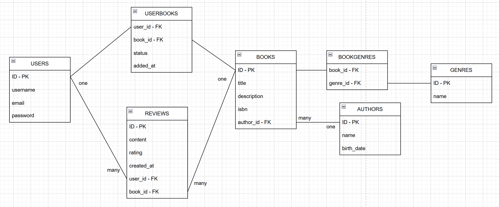

# BookManagementApp
Am creat o platforma interactiva pentru cititori, cu ajutorul careia utilizatorii isi pot evalua cartile preferate, pot scrie recenzii si le pot organiza in liste cu ajutorul carora isi pot planifica lecturile viitoare (to-read), pot monitoriza progresul actual (reading) si pot retine istoricul lecturilor (completed).

<h2>1.  10 cerinte pentru domeniul ales:</h2>

1. Utilizatorii pot crea conturi si se pot autentifica.

2. Utilizatorii pot vizualiza  detaliile si informatiile cartilor.

3. Utilizatorii pot vizualiza informatii despre autori.

3. Utilizatorii pot adauga carti la diferite liste personale (to-read, reading, completed).

4. Utilizatorii pot scrie recenzii pentru carti.

5. Utilizatorii pot evalua carti (de la 1 la 5).

6. Administratorii pot adauga si sterge carti.

7. Administratorii pot adauga si sterge autori.

8. 

9. 

10. 

 
<h2>2.  Document pentru MVP:</h2>

1. <b>Crearea si autentificarea utilizatorilor:</b> utilizatorii isi pot crea conturi in aplicatie, se pot autentifica la acestea si isi pot accesa conturile (pot vedea cartile si listele personale create - to-read, reading, completed).

2. <b>Gestionarea cartilor si autorilor:</b> administratorii pot adauga si sterge descrieri, informatii si detalii despre carti si autori.

3. <b>Gestionarea listelor personale:</b> utilizatorii pot adauga sau sterge carti din listele personale (to-read, reading, completed).

4. <b>Scrierea si stergerea recenziilor:</b> utilizatorii pot scrie si sterge recenzii pentru carti, pot oferi rating-uri (de la 1 la 5) si pot vizualiza recenziile si rating-urile altor utilizatori.

5. <b>Vizualizarea cartilor si autorilor:</b> utilizatorii pot vizualiza cartile si autorii adaugati de administratori.

 
<h2>Diagrama bazei de date:</h2>
</img>
